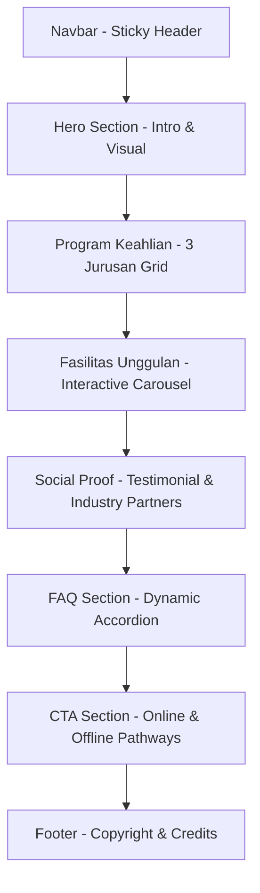

# Product Requirement Document (PRD)
## Project: SPMB SMK Budi Bakti Ciwidey Landing Page

---

## 1. Project Overview
This project delivers a single-page responsive landing page for the Student Admission Program (SPMB) of **SMK Budi Bakti Ciwidey** for the academic year 2026/2027. The page is designed to showcase the school's strengths, program pathways, facilities, and alumni testimonials to drive new student registrations through both online and offline routes.

## 2. Technical Stack
The application is built strictly as a lightweight, single-file HTML5 codebase to guarantee maximum loading speed, zero server build requirements, and seamless deployment:
- **Core Architecture:** Semantic HTML5 & Vanilla JavaScript.
- **Styling Framework:** Tailwind CSS via Play CDN (for custom configuration support).
- **Typography:** Plus Jakarta Sans & Inter hosted via Google Fonts.
- **Visual Assets:** Custom responsive vector illustrations rendered inline via SVG.

---

## 3. Design System & Aesthetics

### 3.1 Color Palette
- **Primary Background:** Pure White (`bg-white` / `#FFFFFF`)
- **Contrast Background:** Very Light Slate (`bg-slate-50` / `#F8FAFC`)
- **Primary Text:** Dark Slate (`text-slate-900` / `#0F172A`)
- **Body Text:** Muted Slate (`text-slate-700` / `#334155` or `text-slate-600` / `#475569`)
- **Accent Color:** Corporate Tech Blue (`bg-blue-600`, `text-blue-600` / `#2563EB`)
- **Highlight Accent:** Muted Sky Blue tint (`bg-blue-50` / `#EFF6FF`)

### 3.2 Typography Hierarchy
- **Primary Font:** Plus Jakarta Sans
- **Headings (H1):** Extrabold, large sizes (`text-4xl` to `text-5xl` or `text-[3.25rem]`), tight line heights.
- **Body:** Clean sans-serif, regular weight, tracking normal, leading relaxed (`leading-relaxed`).

### 3.3 Visual Accents & Interactive Polish
- **Borders:** Thin slate boundaries (`border border-slate-200` or `border-slate-100`).
- **Shadows:** Minimalist shadow details (`shadow-sm`, `hover:shadow-md`) with smooth transition durations (`transition-all duration-300`).
- **Layout Spacing:** Large breathable vertical padding (`py-24`, `pt-28`) ensuring readable and premium whitespace separation.

---

## 4. Page Structure & Features

### 4.1 Sticky Header / Navigation Bar
- **UX Behavior:** Fixed top positioning with blur backdrop filtration (`backdrop-blur-sm bg-white/95`) and subtle bottom divider.
- **Logo:** Typography-only branding `SMK BUDI BAKTI CIWIDEY` with wide letter tracking.
- **Mobile Experience:** Hamburger menu button toggling a vertical slide-down list with smooth height expansion.

### 4.2 Hero Section
- **Visual Grid:** Two-column configuration on desktop collapsing into a single stack on mobile.
- **Left Content:** Informative SPMB badge, prominent heading, action-oriented descriptive copy, CTA button, and key statistics counter (3 Programs, 800+ Alumni, 98% Absorption rate).
- **Right Visual:** High-fidelity inline SVG graphic depicting a dual-monitor software/design environment.

### 4.3 Program Keahlian (Academic Offerings)
- **Grid Layout:** 3-column configuration targeting:
  1. **PPLG** (Pengembangan Perangkat Lunak & Gim) - Focused on web development, mobile applications, and software engineering.
  2. **DKV** (Desain Komunikasi Visual) - Focused on modern graphic design, illustration, and multimedia.
  3. **BRP** (Bisnis Ritel & Pemasaran) - Focused on modern retail operation systems, digital marketing, and data-driven entrepreneurship.
- **Visuals:** Custom vector badges containing thematic blue-hued SVGs representing coding, design brushes, and shopping bags.

### 4.4 Fasilitas Unggulan Carousel
- **UX Interaction:** Slider interface letting users transition among 4 primary facilities:
  1. **Lab PPLG:** Standard-industry PC specifications, 100 Mbps fiber line.
  2. **Studio DKV:** Graphic pen displays, professional photography backdrops, green screen setups.
  3. **Business Center BRP:** Live POS checkout systems and retail mockups.
  4. **Collaboration Hub:** Co-working area with e-library resources.
- **Controls:** Arrow navigators paired with navigation dots connected to Vanilla JS slide-selection listeners.

### 4.5 Social Proof & Testimonials
- **Testimonial Grid:** 3 distinct cards carrying 5-star ratings, testimonials, and alumni avatar designations matching the PPLG, DKV, and BRP paths.
- **Partner Showcase:** Clean typography-based horizontal logo strip representing tech and industry partners (Telkom Indonesia, Google DSC, Dicoding, Gamelab.id, IDN Media).

### 4.6 FAQ Accordion Section
- **Functionality:** 4 collapsible accordion cards. 
- **Auto-collapse Logic:** Opening one item collapses any previously opened item to prevent UI overcrowding.
- **Transitions:** Smooth layout expansions controlled dynamically via height calculations (`scrollHeight` injection in JS) and 180-degree arrow rotations.

### 4.7 Registration Options (CTA Section)
- **Jalur Online:** Action button routing to a web registration form link (`https://bit.ly/spmb-smkbubak`).
- **Jalur Offline:** Embedded physical address widget detailing the registrar office location at the Ciwidey campus, paired with a Google Maps routing hyperlink.

---

## 5. Non-Functional Requirements

### 5.1 Performance & Optimization
- **Zero Dependencies:** All layouts, interactions, icons, and illustrations are coded natively without heavy JS framework overhead.
- **Dynamic CSS Integration:** Tailwind Play CDN allows swift local modifications and instant deployment without server compilers.

### 5.2 Accessibility & SEO
- **Semantic Outline:** Single unique `<h1>` title tags paired with organized nested `<h2>` hierarchies.
- **Interactive Roles:** Custom interactive triggers (`aria-expanded`, `aria-label`) configured across accordions and carousels.
- **SEO Elements:** Metadata tag descriptors defined in the head section.
