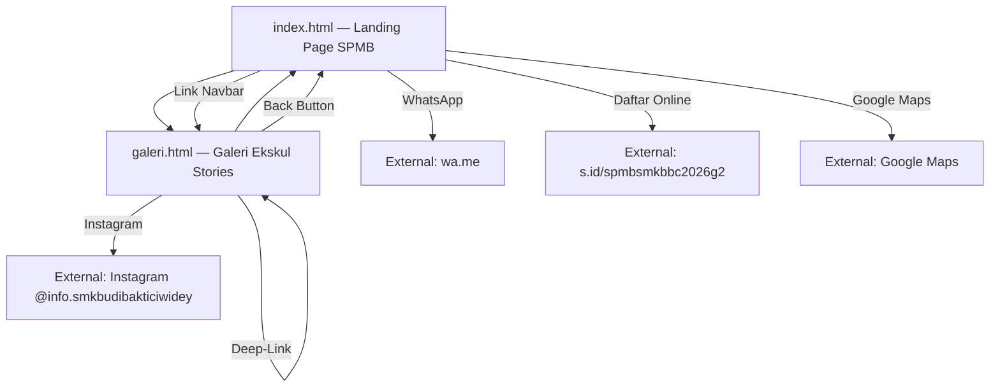

# Product Requirement Document (PRD)
## Project: SPMB & Galeri Ekskul — SMK Budi Bakti Ciwidey

---

## 1. Project Overview
Proyek ini menghadirkan **dua halaman web statis responsif** untuk mendukung **Sistem Penerimaan Murid Baru (SPMB) SMK Budi Bakti Ciwidey Tahun Ajaran 2026/2027** serta galeri interaktif kegiatan kokurikuler dan ekstrakurikuler sekolah:

1. **`index.html`** — Landing page utama SPMB yang menampilkan keunggulan sekolah, program keahlian, fasilitas, testimoni alumni, FAQ, dan jalur pendaftaran.
2. **`galeri.html`** — Halaman Galeri Ekstrakurikuler dengan konsep *Instagram Stories* interaktif, dilengkapi fitur *TikTok-style action sidebar*, deep-linking, dan integrasi media sosial.

---

## 2. Technical Stack

| Layer | Teknologi | Keterangan |
|---|---|---|
| **Arsitektur** | Multi-page static HTML5 | 2 halaman (`index.html`, `galeri.html`) |
| **Styling** | Tailwind CSS via Play CDN | Konfigurasi kustom (`tailwind.config`) untuk font family |
| **Tipografi** | Plus Jakarta Sans | Dimuat via Google Fonts CDN, bobot 400–800 |
| **Scripting** | Vanilla JavaScript (ES6+) | Inline `<script>` tanpa bundler/framework |
| **Aset Visual** | Inline SVG + File SVG + PNG | Ilustrasi kustom, ikon Heroicons-style, dan logo sekolah |
| **Favicon** | `assets/img/favicon.png` | Logo emblem sekolah AI-generated |

### Prinsip Zero-Dependency
- Tidak ada framework JS (React, Vue, dll.)
- Tidak ada build tools / compiler / bundler
- Semua logika interaksi dikodekan secara native
- Deployment langsung tanpa server build

---

## 3. Design System & Aesthetics

### 3.1 Color Palette
| Token | Nilai | Penggunaan |
|---|---|---|
| Primary Background | `#FFFFFF` (`bg-white`) | Latar utama halaman |
| Contrast Background | `#F8FAFC` (`bg-slate-50`) | Seksi alternatif & aksen kartu |
| Primary Text | `#0F172A` (`text-slate-900`) | Heading & teks utama |
| Body Text | `#334155` / `#475569` (`text-slate-700` / `text-slate-600`) | Paragraf & deskripsi |
| Accent Color | `#2563EB` (`bg-blue-600`) | Tombol CTA, badge, aksen utama |
| Highlight Tint | `#EFF6FF` (`bg-blue-50`) | Latar badge, ikon container |
| Footer Background | `#0F172A` (`bg-slate-900`) | Area footer |
| WhatsApp Accent | `#10B981` (`bg-emerald-500`) | Floating helpdesk widget |
| Instagram Gradient | `#f9ce34 → #ee2a7b → #6228d7` | Story ring & CTA Instagram |
| Star Rating | `#FBBF24` (`text-amber-400`) | Bintang testimoni |

### 3.2 Typography Hierarchy
- **Font Family:** Plus Jakarta Sans (primary), Inter (fallback), system-ui
- **H1:** `text-4xl` → `text-5xl` / `text-[3.25rem]`, `font-extrabold`, `leading-tight`
- **H2:** `text-3xl` → `text-4xl`, `font-bold`
- **H3:** `text-lg` → `text-2xl`, `font-bold`
- **Body:** `text-sm` → `text-base`, `font-normal`, `leading-relaxed`
- **Badge/Label:** `text-xs`, `font-semibold`, `tracking-wide uppercase`

### 3.3 Visual Polish & Micro-Interactions
- **Borders:** `border border-slate-200` / `border-slate-100`
- **Shadows:** `shadow-sm` → `hover:shadow-md` (transisi `transition-all duration-300`)
- **Page Load:** Animasi `fadeIn` (opacity 0→1, `ease-out 0.5s`)
- **Hover Effects:** Scale transform, warna transisi, dan shadow elevation pada semua kartu dan tombol
- **Layout Spacing:** Padding vertikal besar (`py-24`, `pt-28`) untuk whitespace premium
- **Rounded Corners:** `rounded-lg` (tombol), `rounded-xl` (kartu), `rounded-2xl` (container besar)

---

## 4. Arsitektur Halaman & Navigasi



### Navigasi Antar Halaman
- **index.html → galeri.html:** Link "Galeri Ekskul" di navbar desktop dan menu mobile
- **galeri.html → index.html:** Tombol panah kembali (←) + logo di header sticky

---

## 5. Halaman 1: `index.html` — Landing Page SPMB

### 5.1 Sticky Header / Navigation Bar
- **Posisi:** `fixed top-0`, `z-50`, backdrop blur (`backdrop-blur-sm bg-white/95`)
- **Logo:** Favicon PNG + teks "SMK BUDI BAKTI CIWIDEY" (`font-bold tracking-wider`)
- **Nav Desktop:** 5 item — Beranda, Program Keahlian, Galeri Ekskul (link ke `galeri.html`), Kontak, Tombol "Daftar" (CTA biru)
- **Nav Mobile:** Hamburger toggle → dropdown vertikal animasi (`max-height` transition, `cubic-bezier`)
  - Ikon berubah dari hamburger ☰ ke close ✕ dengan toggle JS
  - Setiap link otomatis menutup menu setelah diklik (`closeMobileMenu()`)

### 5.2 Hero Section (`#beranda`)
- **Layout:** Grid 2 kolom (`lg:grid-cols-2`), stack 1 kolom di mobile
- **Kolom Kiri:**
  - Badge SPMB 2026/2027 (rounded-full, `bg-blue-50`)
  - Heading H1 utama: "Ayo Masuk **SMK Budi Bakti Ciwidey**"
  - Sub-headline deskriptif tentang RPL
  - Tombol CTA "Daftar Sekarang" dengan ikon panah →
  - Statistik: **3** Program Keahlian | **800+** Alumni | **98%** Terserap Industri (divider vertikal)
- **Kolom Kanan:**
  - Dekoratif rotasi (`-rotate-2`, `bg-blue-50`)
  - Inline SVG ilustrasi dual-monitor programming environment (meja, 2 monitor, keyboard, mouse, cangkir kopi, elemen floating `</>`, `{ }`)

### 5.3 Program Keahlian (`#program-keahlian`)
- **Background:** `bg-slate-50` dengan border atas/bawah
- **Header:** "Pilihan Jurusan" label + "Konsentrasi Keahlian" H2 + garis aksen biru
- **Grid:** 3 kolom (`md:grid-cols-3`), collapse ke 1 kolom di mobile
- **Kartu (3 buah):**

| ID | Jurusan | Ikon SVG | Fokus |
|---|---|---|---|
| `dept_pplg` | Pengembangan Perangkat Lunak & Gim | Code brackets `</>` | Rekayasa perangkat lunak, web & mobile |
| `dept_dkv` | Desain Komunikasi Visual | Brush/pen | Kreativitas visual, desain grafis, multimedia |
| `dept_brp` | Bisnis Ritel & Pemasaran | Shopping bag | Manajemen bisnis, pemasaran digital, kewirausahaan |

- **Interaksi:** Hover shadow elevation (`hover:shadow-md`), ikon container berubah warna (`group-hover:bg-blue-100`)

### 5.4 Fasilitas Unggulan Carousel (`#fasilitas`)
- **Tipe:** Carousel slider dengan 4 slide
- **Kontainer:** `bg-slate-50`, `rounded-2xl`, min-height 400–440px
- **Slide Content (per item):** Grid 2 kolom — deskripsi teks (kiri) + ilustrasi SVG (kanan)

| Slide | Label | Judul | Fitur Unggulan | SVG |
|---|---|---|---|---|
| 0 | PPLG Facility | Lab Komputer & Software | PC i7/16GB/SSD, Fiber 100 Mbps, Lisensi resmi | Monitor + code editor |
| 1 | DKV Facility | Studio Desain Komunikasi Visual | Drawing tablet, Green screen, DSLR/Mirrorless | Brush curves + shapes |
| 2 | BRP Facility | Business Center & Mini Market | POS System, Mockup minimarket, Manajemen stok | Shelf display grid |
| 3 | General Facility | Library & Collaboration Hub | E-Library, Area diskusi, AC | Book/globe shape |

- **Kontrol Navigasi:**
  - 4 navigation dots (`#facility-dots`) — klik untuk langsung ke slide tertentu
  - Tombol Prev / Next (`#facility-prev`, `#facility-next`) — loop circular
- **Transisi:** `opacity` + `translate-x` dengan `duration-500`, pointer-events toggle

### 5.5 Social Proof & Testimoni (`#testimoni`)
- **Testimonial Grid:** 3 kartu (`md:grid-cols-3`)
- **Per Kartu:**
  - 5 bintang (`text-amber-400`, filled SVG star)
  - Blockquote teks testimoni
  - Avatar inisial (lingkaran `bg-blue-100`), nama alumni, jurusan & angkatan

| Alumni | Jurusan | Angkatan | Kutipan Singkat |
|---|---|---|---|
| Rizky Aditya (RA) | PPLG | 2023 | Diterima Junior Web Developer 2 minggu setelah lulus |
| Siti Aisyah (SA) | DKV | 2022 | Bekerja sebagai Graphic Designer di agency Bandung |
| Dinda Nurhaliza (DN) | BRP | 2024 | Mengelola toko online & supervisor marketing ritel nasional |

- **Mitra Industri:** Horizontal text-badge strip
  - Telkom Indonesia, Google DSC, Dicoding, Gamelab.id, IDN Media
  - Styling: `text-slate-300 font-bold`, hover → `text-slate-400`

### 5.6 FAQ Accordion (`#faq`)
- **Background:** `bg-slate-50`, border atas/bawah
- **Jumlah:** 4 accordion item
- **Auto-Collapse Logic:** Membuka satu item otomatis menutup yang lain
- **Transisi:** `maxHeight` via `scrollHeight` JS, rotasi ikon chevron 180°
- **State Visual:** Item aktif mendapat `border-blue-200` + `bg-blue-50/10`

| # | Pertanyaan |
|---|---|
| 1 | Apa saja syarat pendaftaran masuk SMK Budi Bakti Ciwidey? |
| 2 | Berapa biaya pendaftaran dan SPP bulanan? |
| 3 | Apakah ada program beasiswa? |
| 4 | Bagaimana alur seleksi masuk SMK Budi Bakti Ciwidey? |

### 5.7 Pendaftaran / CTA Section (`#daftar`)
- **Grid:** 2 kolom (`md:grid-cols-2`), max-width `4xl`
- **Jalur Online:**
  - Ikon globe, heading "Pendaftaran Online"
  - Deskripsi formulir digital
  - Tombol CTA biru: "Isi Formulir Online" → `https://s.id/spmbsmkbbc2026g2` (target `_blank`)
- **Jalur Offline:**
  - Ikon map pin, heading "Pendaftaran Offline"
  - Deskripsi kunjungan langsung
  - Widget alamat sekretariat (box `bg-slate-50`):
    - **Kampus SMK Budi Bakti Ciwidey**
    - Jl. Raya Ciwidey - Patengan No. 120, Ciwidey, Kec. Ciwidey, Kabupaten Bandung, Jawa Barat 40973
  - Tombol outline: "Petunjuk Arah (Google Maps)" → Google Maps routing

### 5.8 Footer (`#kontak`)
- **Background:** `bg-slate-900`
- **Konten:** Copyright © 2026 + "Dikembangkan oleh Unit Produksi RPL"
- **Layout:** Flex row di desktop, column di mobile

### 5.9 Floating WhatsApp Helpdesk Widget
- **Posisi:** `fixed bottom-6 right-6`, `z-50`
- **Trigger Button:**
  - Lingkaran emerald (`bg-emerald-500`, `w-14 h-14`)
  - Efek ping/pulse animasi (`animate-ping`) — berhenti saat hover
  - Badge notifikasi merah "1" di pojok kanan atas
  - Ikon chat bubble dengan hover rotate
- **Popover Window:**
  - Header biru: avatar "CS", judul "Help Desk SPMB", status online (dot hijau `animate-pulse`)
  - Body: teks bantuan + tombol "Hubungi via WhatsApp" (emerald, ikon WA)
  - Link: `wa.me/628123456789` dengan pre-filled text
  - Transisi: `opacity` + `translate-y` animasi buka/tutup
  - Toggle via `toggleHelpdesk()` JS function

---

## 6. Halaman 2: `galeri.html` — Galeri Ekstrakurikuler

### 6.1 Header / Navbar
- **Posisi:** `sticky top-0`, `z-40`, backdrop blur
- **Elemen:** Tombol kembali (← panah) + Logo + teks branding
- **Link:** Kembali ke `index.html`

### 6.2 Page Header
- Label "Galeri Kegiatan" + H1 "Ekstrakurikuler" + garis aksen biru + deskripsi

### 6.3 Stories Tray (Instagram-Style Horizontal Slider)
- **Layout:** Horizontal scroll, `overflow-x-auto`, centered on desktop
- **Scrollbar:** Hidden via CSS (`scrollbar-none`)
- **Drag-to-Scroll:** Vanilla JS mouse event listeners untuk pengalaman drag horizontal di desktop (speed multiplier 1.5x)
- **5 Story Circles + 1 Instagram Shortcut:**

| Index | Ekskul | Ikon SVG | Ring Gradient |
|---|---|---|---|
| 0 | Pramuka | House/camp icon | Instagram gradient (`#f9ce34 → #ee2a7b → #6228d7`) |
| 1 | Futsal | Flame/sport icon | Instagram gradient |
| 2 | IT Club | Code brackets `</>` | Instagram gradient |
| 3 | Paduan Suara | Music note | Instagram gradient |
| 4 | Paskibra | Flag | Instagram gradient |
| — | Instagram | Instagram logo | Instagram gradient (filled background) |

- **Ring State:** Viewed stories berubah ke `story-ring-viewed` (gray `#cbd5e1`)
- **Ukuran Ring:** `w-20 h-20` mobile → `w-24 h-24` desktop
- **Hover:** `scale-105` transform

### 6.4 Grid Gallery Preview
- **Layout:** 5 kolom (`lg:grid-cols-5`), 2 kolom di SM, 1 kolom di mobile
- **Per Card:**
  - Aspect ratio `3:4`
  - Cover image (`assets/img/story_*.svg`)
  - Gradient overlay (`from-slate-900/60`) di bagian bawah dengan label nama ekskul
  - Hover: `scale-105` pada gambar, shadow elevation
  - Klik: membuka story modal (`openStory(index)`)

### 6.5 Story Modal (Fullscreen Interactive Viewer)
- **Container:** `fixed inset-0`, `z-50`, background `bg-slate-950/98` dengan `backdrop-blur-md`
- **Inner Frame:** `max-w-[430px]`, aspect `9:16` (simulasi HP), `rounded-2xl` di desktop, fullscreen di mobile
- **Progress Bar:**
  - Segmen per story (5 total) di bagian atas
  - Fill animasi progresif (0→100%) selama `5000ms` per story
  - Story sebelumnya ditampilkan 100% filled
  - Dikontrol via `setInterval` dengan update setiap `30ms`
- **Story Header:** Avatar "SBB", judul ekskul dinamis, label sekolah, tombol close (X)
- **Navigasi:**
  - **Tap kiri (1/3 layar):** Story sebelumnya (`prevSegment()`)
  - **Tap kanan (2/3 layar):** Story berikutnya (`nextSegment()`)
  - **Keyboard:** ArrowLeft, ArrowRight, Escape
  - **Auto-advance:** Otomatis lanjut setelah 5 detik
  - **Loop end:** Story terakhir selesai → modal tertutup

### 6.6 TikTok-Style Action Sidebar
- **Posisi:** `absolute right-4 bottom-28`, `z-30`
- **Tombol Love (Suka):**
  - Toggle heart outline ↔ filled (merah `text-red-500`)
  - Animasi bounce scale (`0.85 → 1.15 → 1.0`, cubic-bezier)
  - State tracking per story (`likedStories` object)
- **Tombol Share (Bagikan):**
  - Salin deep-link URL ke clipboard (`navigator.clipboard.writeText`)
  - Format: `{origin}{pathname}?story={index}`
  - Hover translate micro-animation

### 6.7 Toast Notification (Share Feedback)
- **Posisi:** Bottom center dalam modal
- **Desain:** Glassmorphic (`bg-slate-900/90`, `border-slate-700/50`, `backdrop-blur-sm`)
- **Konten:** Ikon centang hijau + "Tautan cerita berhasil disalin!"
- **Durasi:** Muncul 2 detik lalu fade out

### 6.8 Deep-Linking Support
- **URL Pattern:** `galeri.html?story=X` (X = 0–4)
- **Perilaku:** Saat halaman dimuat, parameter `story` dibaca dan modal langsung dibuka ke story yang sesuai (delay 400ms)

### 6.9 Instagram CTA Banner
- **Posisi:** Bawah halaman, sebelum footer
- **Desain:** `rounded-2xl`, gradient background halus, ambient floating gradients (purple & pink blur circles)
- **Konten:**
  - Ikon Instagram dengan gradient background + hover rotate/scale
  - Heading: "Jelajahi Selengkapnya Keseruan Kami!"
  - Deskripsi ajakan follow
  - Tombol CTA gradient Instagram: "Meluncur ke Instagram" → `https://www.instagram.com/info.smkbudibakticiwidey`
  - Hover: `scale-105`, `active:scale-95`

### 6.10 Footer
- Identik dengan footer `index.html` (bg-slate-900, copyright, credit)

---

## 7. File Asset Inventory

```
kokurikuler/
├── assets/
│   ├── img/
│   │   ├── favicon.png             # Logo emblem sekolah (322 KB, AI-generated)
│   │   ├── logo.png                # Logo sekolah resmi (594 KB)
│   │   ├── story_pramuka.svg       # Ilustrasi cerita Pramuka (3.6 KB)
│   │   ├── story_futsal.svg        # Ilustrasi cerita Futsal (4.9 KB)
│   │   ├── story_tech_club.svg     # Ilustrasi cerita IT Club (5.3 KB)
│   │   ├── story_art_club.svg      # Ilustrasi cerita Paduan Suara (3.4 KB)
│   │   └── story_paskibra.svg      # Ilustrasi cerita Paskibra (3.3 KB)
│   ├── desktop-uiux.jpeg           # Mockup dokumentasi desktop (423 KB)
│   └── mobile-uiux.jpeg            # Mockup dokumentasi mobile (378 KB)
├── index.html                      # Landing page SPMB (67 KB, 1120 baris)
├── galeri.html                     # Galeri ekskul stories (36 KB, 727 baris)
├── prd.md                          # Product Requirement Document (file ini)
└── README.md                       # Dokumentasi proyek
```

---

## 8. Non-Functional Requirements

### 8.1 Performance & Optimization
- **Zero Build:** Tidak memerlukan `npm install`, webpack, atau server compiler
- **CDN-Powered:** Tailwind CSS dan Google Fonts dimuat via CDN untuk performa optimal
- **Inline SVG:** Semua ilustrasi utama di `index.html` menggunakan inline SVG (zero HTTP request tambahan)
- **File SVG:** Aset story di `galeri.html` menggunakan file SVG ringan (<6 KB per file)
- **Total Page Size:** `index.html` ~67 KB, `galeri.html` ~36 KB (sebelum CDN assets)

### 8.2 Accessibility (A11y)
- **Semantic HTML:** Hierarki heading tunggal `<h1>` per halaman, `<h2>` nested terstruktur
- **ARIA Attributes:**
  - `aria-expanded` pada accordion triggers dan hamburger menu
  - `aria-label` pada semua tombol interaktif (carousel, modal, helpdesk)
- **Keyboard Navigation:** Story modal mendukung Arrow keys + Escape
- **Focus Management:** `focus:outline-none` dengan visual feedback melalui hover/active states

### 8.3 SEO
- **Title Tags:** Deskriptif per halaman (SPMB / Galeri Ekstrakurikuler)
- **Meta Description:** Unique per halaman, mengandung keyword target
- **Favicon:** Custom PNG favicon terkonfigurasi
- **Semantic Elements:** `<header>`, `<main>`, `<section>`, `<footer>`, `<nav>`, `<blockquote>`
- **Scroll Behavior:** `scroll-smooth` pada `<html>` untuk navigasi anchor halus

### 8.4 Responsiveness
- **Breakpoints:** Mengikuti default Tailwind (`sm: 640px`, `md: 768px`, `lg: 1024px`)
- **Mobile-First:** Semua komponen dirancang dari mobile lalu diperluas ke desktop
- **Container:** `max-w-7xl mx-auto px-6` sebagai wrapper konsisten
- **Adaptive Components:**
  - Navbar: hamburger (mobile) → horizontal links (desktop)
  - Hero: single column (mobile) → 2 columns (desktop)
  - Cards: 1 column → 2–3 columns
  - Gallery: 1 column → 2 columns → 5 columns
  - Story modal: fullscreen (mobile) → centered 430px frame (desktop)

---

## 9. External Links & Integrations

| Tujuan | URL | Digunakan di |
|---|---|---|
| Formulir Pendaftaran Online | `https://s.id/spmbsmkbbc2026g2` | `index.html` — CTA Section |
| WhatsApp Helpdesk | `https://wa.me/628123456789?text=...` | `index.html` — Floating Widget |
| Google Maps | `https://maps.google.com/?q=SMK+Budi+Bakti+Ciwidey` | `index.html` — CTA Section |
| Instagram Resmi | `https://www.instagram.com/info.smkbudibakticiwidey` | `galeri.html` — Story Tray & CTA Banner |

---

## 10. Catatan Kustomisasi

1. **Nomor WhatsApp:** Ubah `628123456789` di `index.html` (sekitar baris 1089) untuk mengganti nomor admin helpdesk.
2. **Link Formulir Online:** Ubah URL `https://s.id/spmbsmkbbc2026g2` di `index.html` (baris 874) jika tautan formulir berubah.
3. **Akun Instagram:** Cari `info.smkbudibakticiwidey` di `galeri.html` untuk mengubah akun Instagram tujuan.
4. **Durasi Story:** Konstanta `STORY_DURATION = 5000` di `galeri.html` (baris 497) mengatur durasi per story dalam milidetik.
5. **Menambah Ekskul Baru:** Tambahkan entry baru ke array `stories[]` di `galeri.html`, buat file SVG baru di `assets/img/`, dan tambahkan circle button serta card gallery yang sesuai.
